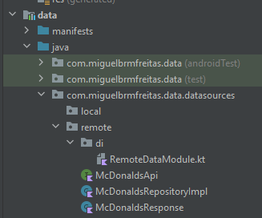

# Mc Donald's Menu
Android app for McDonald's Menu. The data is fetched from a [public API](https://mcdonalds.trio.dev/menu) and presented in the UI.

## Technical Design
The high level app architecture looks like this. It's inspired by [Uncle Bob's Clean Architecture](https://blog.cleancoder.com/uncle-bob/2012/08/13/the-clean-architecture.html) + [MVVM](https://developer.android.com/topic/architecture), although not totally by the book. Each layer is an separate module on the project. It may seem overkill at first, but the app was made so it can grow easily keeping separation of concerns, reusability and quality of code.


[Check this link to see the full design.](https://drive.google.com/file/d/186X4F1Iu6zTeHIEg2ga1TeBOhPXe8ZZu/view?usp=sharing)

## Domain Module


The domain module is a pure kotlin module with the abstractation of business logic. It has no Android-related dependency.  

- UseCases: makes the necessary calls from the repositories and get it ready to the UI. GetMenusUseCase calls the necessary method from the McDonaldsRepository.
- Entities: basically the models from the app. No need for complicated mappers to the UI since the data classes populated by the use case are already enough.
- Repositories: interface to get the data from the data module. McDonaldsRepository does the job.
- ApiResult: map API results for success and failure (error).

## Data Module



The data module is responsible for all data sources that the app relies on. It could be either a remote data source (network) or a local database. Although the Local data source is on the technical design, on this first version of the app only the remote data source was implemented to fetch the data from the [McDonald's API](https://mcdonalds.trio.dev/menu).

- Remote Data Source (Network)
    - RepositoryImpl: the data module makes the actual implementation of the Repository interface. From there the API services are called.
    - McdonaldsAPI: service with the contract to fetch from the API itself.
    - McDonaldsResponse: data class to hold the raw response from the server.
    - RemoteDataModule: define the Dependency Injection for network and repository calls.


## App Module


The app module is the starting point to the app and works as the presentation layer to handle all UI logic and design. To do so, a MVVM approach is used. The app module also takes care of the Dependency Injection for all layers through the Application class. It takes advantage from modern Android Jetpack libraries, Kotlin features and SOLID concepts to deliver clean and efficient code.

- Activities: each Activity is an app screen to interact with the user and runs along with the app lifecycle. DataBinding is used to populate views with data from ViewModel. The Activity is a dumb view with its state controlled by ViewModel. MenuListActivity is the only and main Activity so far, but it could easily grow.
- Fragments: each Fragment is an encapsulated component attached to an Activity, a smaller part of the view. Also uses DataBinding to observe data from ViewModel. Now we have ItemDetailBottomSheetFragment to show the details of a clicked item.
- ViewModel: a ViewModel class is responsible for all the view logic and data, handling and managing all UI-related data. The ViewModel is aware of the view's lifecycle. It calls the UseCases from domain layer and handle all the data flow to be observed by the views with the help of Coroutines. MenuListViewModel is the main only viewmodel so far and calls GetMenusUseCase
- Adapters: implementation of RecyclerView.Adapter and manages all the logic to deal with RecyclerView lists. It has rules to bind each element of an array (with DataBinding) at every position
- MainApplication: the start of everything. Deals with app-wide state and injects the dependency with Koin from AppModule and RemoteDataModule
- Base classes: abstract classes to be reused by activities and viewmodels
- Extensions: takes advantaged from Kotlin extensions features to write custom 


## Stack
- Coded in [Kotlin](https://kotlinlang.org)
- UI and Android-related libraries from [Android Jetpack](https://developer.android.com/jetpack)
- Network calls with [Retrofit](https://github.com/square/retrofit)
- JSON parsing with [Moshi](https://github.com/square/moshi)
- Concurrency with [Coroutines](https://kotlin.github.io/kotlinx.coroutines/)
- Dependency Injection with [Koin](https://insert-koin.io/)
- Async image loading with [Glide](https://github.com/bumptech/glide) 

## Next steps
- [ ] Create a theme for app layout.

- [ ] Room Database to persist data locally.

- [ ] Map other attributes from the JSON response to fetch and show in the app, like operationDays.

- [ ] Run UI tests with Espresso

## 📃 License

```
MIT License

Copyright (c) 2022 Miguel Barreto Rezende Marques de Freitas

Permission is hereby granted, free of charge, to any person obtaining a copy
of this software and associated documentation files (the "Software"), to deal
in the Software without restriction, including without limitation the rights
to use, copy, modify, merge, publish, distribute, sublicense, and/or sell
copies of the Software, and to permit persons to whom the Software is
furnished to do so, subject to the following conditions:

The above copyright notice and this permission notice shall be included in all
copies or substantial portions of the Software.

THE SOFTWARE IS PROVIDED "AS IS", WITHOUT WARRANTY OF ANY KIND, EXPRESS OR
IMPLIED, INCLUDING BUT NOT LIMITED TO THE WARRANTIES OF MERCHANTABILITY,
FITNESS FOR A PARTICULAR PURPOSE AND NONINFRINGEMENT. IN NO EVENT SHALL THE
AUTHORS OR COPYRIGHT HOLDERS BE LIABLE FOR ANY CLAIM, DAMAGES OR OTHER
LIABILITY, WHETHER IN AN ACTION OF CONTRACT, TORT OR OTHERWISE, ARISING FROM,
OUT OF OR IN CONNECTION WITH THE SOFTWARE OR THE USE OR OTHER DEALINGS IN THE
SOFTWARE.
```
